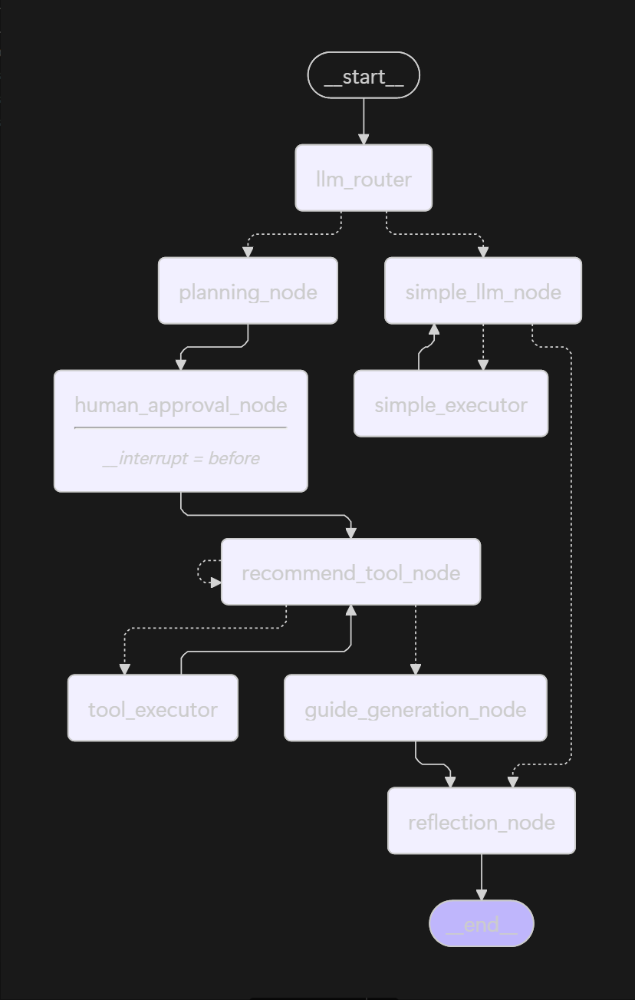

# 생성형 AI 응용 FINAL PROJECT

팀 명: AI 101

팀장: 박승진

팀원: 고대욱, 김성겸, 주소영

| 이름   | 역할                                                                                                                                                   |
| ------ | ------------------------------------------------------------------------------------------------------------------------------------------------------ |
| 박승진 | 데이터 수집 (PDF 데이터), Recommend Tool 노드 (RAG, Google Search), gradio mount                                                                       |
| 고대욱 | Human Approval 노드 (인터럽트), Reflection 노드 (메모리), conditional edge                                                                              |
| 김성겸 | Guide Generation 노드 (Google Search), Simple LLM 노드                                                                                                 |
| 주소영 | LLM Router 노드, Planning 노드, Simple Tool Executor 노드 (계산기, 시간)                                                                               |

# 1. 프로젝트 개요

생성형 AI의 급격한 발전으로 관련 서비스들이 기업과 개인으로부터 쏟아져 나오고 있습니다. 하지만 소비자 입장에서는 이 분야에 관심이 없다면, 자신의 업무에 어떤 서비스를 활용할 수 있는지 파악하기 어렵습니다. 대표적인 예로 수많은 서비스들 중 ChatGPT만 사용하는 일반 사용자들이 많고, 심지어 단순히 챗봇 형태로만 사용하는 경우를 들 수 있습니다.

따라서 우리가 개발하려는 **AI 101 에이전트는 사용자의 업무를 효율적인 세부 단계로 분해하고, 각 단계에 적합한 AI 서비스를 추천하는 것을 주요 기능으로 합니다.**

# 2. 프로젝트 구조 및 파일 설명

---

## 2.1 루트 파일

| 파일             | 설명                                               |
| ---------------- | -------------------------------------------------- |
| main.py          | 애플리케이션 진입점. uvicorn으로 FastAPI 서버 실행 |
| requirements.txt | 의존성 패키지 목록                                 |
| .env             | 환경변수 설정 파일                                 |
| .gitignore       | Git 제외 파일 목록                                 |

- 특히 env 파일에서는 `OPENAI_API_KEY`, `GOOGLE_API_KEY`, `GOOGLE_SEARCH_ENGINE_ID` 변수를 사용합니다.

---

## 2.2 agent/ - LangGraph 에이전트 핵심 모듈

| 파일       | 설명                                                        |
| ---------- | ----------------------------------------------------------- |
| graph.py   | StateGraph 구성, 노드 추가, 조건부 엣지 설정, 에이전트 실행 |
| state.py   | 에이전트 상태 TypedDict 정의 (messages, sub_tasks 등)       |
| routing.py | 노드 간 분기 로직 (route_after_llm_router 등)               |
| hitl.py    | Human-in-the-Loop 피드백 처리 (승인/수정/취소)              |

### 2.2.1 agent/nodes/ - 그래프 노드 구현

| 파일               | 설명                                        |
| ------------------ | ------------------------------------------- |
| router.py          | 질문 유형 분류 (단순 Q&A vs 복잡 작업)      |
| planning.py        | 복잡 작업을 2-5개 서브태스크로 분해         |
| approval.py        | HITL 승인 대기 노드 (interrupt_before 설정) |
| recommend.py       | ReAct 패턴으로 AI 도구 추천                 |
| executor.py        | Tool Call 실행, 2단계 점수 합산             |
| guide.py           | 최종 워크플로우 가이드 생성                 |
| reflection.py      | 선호도 추출 후 장기 메모리 저장             |
| simple_react.py    | 단순 질문용 ReAct 노드                      |
| simple_executor.py | 단순 질문용 도구 실행                       |

---

## 2.3 app/ - 웹 애플리케이션 계층

| 파일             | 설명                                                        |
| ---------------- | ----------------------------------------------------------- |
| api/routes.py    | FastAPI REST API 엔드포인트 (/chat/start, /chat/approve 등) |
| api/schemas.py   | Pydantic 요청/응답 스키마                                   |
| ui/gradio_app.py | Gradio 채팅 UI 구현                                         |

---

## 2.4 core/ - 핵심 인프라 모듈

| 파일      | 설명                                           |
| --------- | ---------------------------------------------- |
| config.py | 전역 설정 (LLM_MODEL, SIMILARITY_THRESHOLD 등) |
| llm.py    | ChatOpenAI 인스턴스 팩토리                     |
| memory.py | ChromaDB 기반 벡터 저장소, 사용자 프로필 관리  |
| utils.py  | 공통 유틸리티 함수 (extract_json 등 JSON 파싱) |

---

## 2.5 tools/ - LangChain 도구 모듈

| 파일            | 설명                                       |
| --------------- | ------------------------------------------ |
| registry.py     | 도구 등록 및 실행 중앙 관리                |
| search.py       | RAG 검색 (2단계 점수 합산), Google 웹 검색 |
| calculator.py   | 구독료 계산, 수학 계산                     |
| time_tools.py   | 최신성 확인, 현재 시간 조회                |
| memory_tools.py | 사용자 메모리 읽기/쓰기                    |

---

## 2.6 prompts/ - LLM 프롬프트 템플릿

| 파일          | 설명                                  |
| ------------- | ------------------------------------- |
| router.py     | 질문 유형 분류 프롬프트               |
| planning.py   | 서브태스크 분해 프롬프트              |
| recommend.py  | 도구 추천 ReAct 프롬프트              |
| guide.py      | 가이드 생성 프롬프트 (복잡/단순/폴백) |
| reflection.py | 선호도 추출 프롬프트                  |
| intent.py     | 사용자 의도 분석 프롬프트             |
| formatters.py | 결과 포맷팅 유틸리티                  |

---

## 2.7 data/ - 데이터 파일

| 파일              | 설명                      |
| ----------------- | ------------------------- |
| ai_tools.json     | AI 도구 정보 데이터베이스 |
| sns_reseach_1.pdf | PDF 지식베이스 문서       |
| sns_reseach_2.pdf | PDF 지식베이스 문서       |

---

## 2.8 기타 디렉토리

| 디렉토리 | 설명                 |
| -------- | -------------------- |
| db/      | ChromaDB 영구 저장소 |
| venv/    | Python 가상환경      |

# 3. 그래프 다이어그램 (데이터 흐름)

`graph.get_graph().draw_mermaid()` 를 사용하여 생성함.

---

- 업무 관련 질문인 경우 (ex 생성형 AI에 대해 발표해야 돼. 자동차 회사 로고를 만들어야 돼 등)

llm router: 복잡한 질문으로 분류

→ planning node: 해당 질문을 해결하기 위한 효율적인 세부 단계로 분할

(planning 결과에 대해 사용자 승인/수정/거부 등 결정)

→ recommend tool node: 결정된 각 세부 단계별로 적절한 AI 서비스 추천 ↔ tool executor (벡터임베딩된 도구 데이터를 추천하거나, 추천된 도구의 점수가 너무 낮다면 google search로 fallback)

→ guide_generation_node: 각 서브태스크 별 추천된 도구를 토대로 google search 를 사용하여, 각 단계에 대하여 해당 도구를 어떻게 사용해야하는지 가이드 생성.

→ reflection node: 장기 메모리 반영

→ 종료

- 간단한 업무인 경우 (ex 비디오 생성형 AI 추천해줘, 현재 날짜로부터 GPT 5 며칠전에 나왔는지 계산해줘)

llm router: 간단한 질문으로 분류

→ simple llm node: 사용자 질문에서 필요한 tool 선택 ↔ simple tool executor: 앞서 선택한 tool 실제 호출

→ reflection node: 장기 메모리 반영

→ 종료
